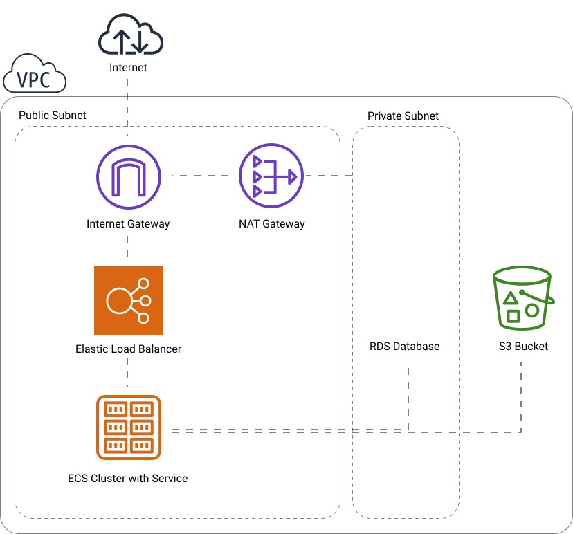

The [AWS Cloud Development Kit](https://github.com/awslabs/aws-cdk) is one of the newest tools from AWS Labs and I feel like it's not getting enough attention. Why? Let's start with quick quote which explains this tool:

