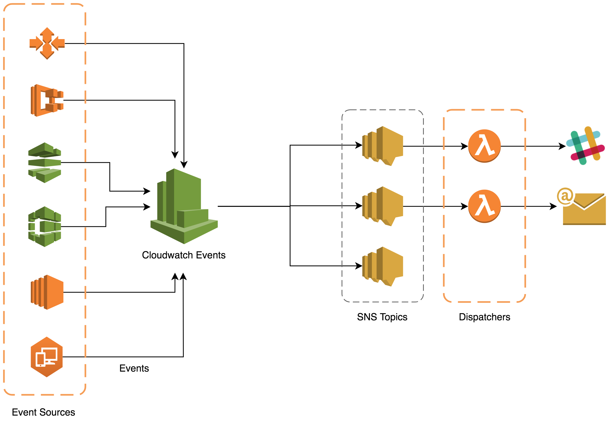

The [AWS Cloud Development Kit](https://github.com/awslabs/aws-cdk) is one of the newest tools from AWS Labs and I feel like it's not getting enough attention. Why? Let's start with quick quote which explains this tool:

> The AWS Cloud Development Kit (AWS CDK) is an open-source software development framework to define cloud infrastructure in code and provision it through AWS CloudFormation. The CDK integrates fully with AWS services and offers a higher level object-oriented abstraction to define AWS resources imperatively. Using the CDK’s library of infrastructure constructs, you can easily encapsulate AWS best practices in your infrastructure definition and share it without worrying about boilerplate logic. 

This definition gives us a few key characteristics:

1. It's using CloudFormation under the hood, just like [Serverless Framework](https://github.com/serverless/serverless)
2. It's "imperative" unlike CloudFormation or Terraform which are declarative
3. Offers high level abstractions to make development easier
4. It's defined using code instead of YAML or JSON

